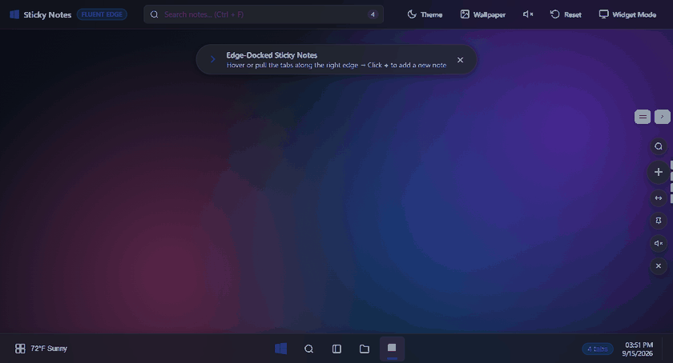
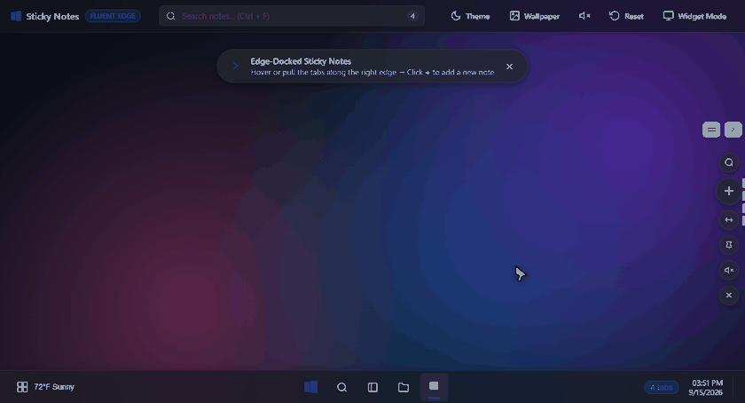

# 📌 Fluent Notes · Windows 11 Edge-Docked Sticky Notes Widget

<p align="center">
  
</p>

<p align="center">
  <strong>A modern, unobtrusive edge-docked sticky notes widget crafted with native Windows 11 Fluent & Acrylic aesthetics.</strong><br>
  <em>Dock to your screen edge, collapse for 100% click-through access, drag anywhere, and never lose your thoughts again.</em>
</p>

<p align="center">
  <a href="#-quick-start"></a>
  <a href="#-project-architecture"></a>
  <a href="#-windows-11-fluent-aesthetics--dynamic-themes"></a>
  <a href="#-local-first-privacy--zero-data-loss"></a>
  <a href="LICENSE"></a>
</p>

---

## 🎬 Live Demonstration

<p align="center">
  
</p>

<p align="center">
  <em>Smooth tab peek previews, rich acrylic modal editor, pastel color palette, and dynamic theme switching.</em>
</p>

---

## 📑 Table of Contents

- [🌟 Why Fluent Notes?](#-why-fluent-notes)
- [✨ Key Features with Visual Demos](#-key-features-with-visual-demos)
  - [1. Ergonomic Edge Docking & 100% Click-Through](#1-ergonomic-edge-docking--100-click-through)
  - [2. Interactive Checklists & Rich Notes](#2-interactive-checklists--rich-notes)
  - [3. Windows 11 Fluent Aesthetics & Dynamic Themes](#3-windows-11-fluent-aesthetics--dynamic-themes)
  - [4. Local-First Privacy & Zero Data Loss](#4-local-first-privacy--zero-data-loss)
- [⌨️ Keyboard Shortcuts](#️-keyboard-shortcuts)
- [🚀 Quick Start](#-quick-start)
  - [Option 1: Standalone Portable Release (Recommended)](#option-1-standalone-portable-release-recommended)
  - [Option 2: Run from Source](#option-2-run-from-source)
- [📦 Packaging & Distribution](#-packaging--distribution)
- [⚙️ Auto-Start on Windows Boot](#️-auto-start-on-windows-boot)
- [📂 Project Architecture](#-project-architecture)
- [🤝 Contributing](#-contributing)
- [📄 License](#-license)

---

## 🌟 Why Fluent Notes?

Most desktop sticky note applications either:
1. Clutter the middle of your screen, obscuring active windows and browser tabs.
2. Block window scrollbars or corner buttons when left open.
3. Require clunky cloud logins or phone apps just to jot down quick notes.
4. Look like dated software from 2005.

**Fluent Notes** takes inspiration from modern Windows 11 design principles and multi-monitor ergonomic workflows:

- 🪟 **Always Available, Never in Your Way**: Tucks cleanly to either screen bezel. Hover over a tab to peek its contents without taking focus away from your active work.
- 💨 **100% Click-Through Behind the Dock**: Collapse the dock with a click or hotkey (`Ctrl+Alt+H`). Mouse events pass through completely to underlying browsers, IDEs, and documents.
- 🎯 **Total Positional Freedom**: Drag the dock vertically along your screen edge to your favorite sweet spot, or switch between **Right Edge** and **Left Edge** in a single click.
- 🎨 **Curated Pastel Palette**: Calming, aesthetic pastel shades that look stunning on both Light and Dark Windows 11 themes.
- 🛡️ **Zero Tracking, Zero Cloud Lock-In**: Everything is saved locally on your device with automatic dual-mirror backups.

---

## ✨ Key Features with Visual Demos

### 1. Ergonomic Edge Docking & 100% Click-Through

<p align="center">
  
</p>

- **1-Click Collapse (`Ctrl + Alt + H`)**: Folds the dock seamlessly into the bezel, displaying an ultra-thin **`NOTES`** pill.
- **Native Click-Through (`setIgnoreMouseEvents`)**: When collapsed, the window is fully transparent to mouse input—click buttons, select text, and scroll web pages directly behind where the dock sits.
- **Vertical Grip Handle (`:::`)**: Click and drag vertically along the bezel to reposition the dock at any height. Double-click the grip handle to instantly snap back to center (`50%`).
- **Edge Switcher (`⇄`)**: Swap between **Right Edge** and **Left Edge** docking in one click (perfect for avoiding browser scrollbars or multi-monitor boundary issues).
- **Persistent State**: Dock position, screen edge, and collapsed state are remembered across restarts in `app_state.json`.

---

### 2. Interactive Checklists & Rich Notes

<p align="center">
  
</p>

- **Interactive Todo Checklists**: Format any line with `[ ]` or `[x]` to turn it into an interactive checkbox. Check off items directly from the preview card or modal editor with animated strike-throughs.
- **Rich Markdown Formatting**: Bold, italic, strikethrough, underline, and clean bullet lists.
- **Curated Pastel Colorways**: Choose between 7 calming pastel shades:
  - 🌸 **Pastel Rose**
  - 💜 **Lavender Whisper**
  - 🌿 **Mint Serenity**
  - 🌊 **Sky Blue**
  - 🧈 **Buttercream Cream**
  - 🍑 **Peach Glow**
  - 🐘 **Slate Elegance**
- **Live Save Indicator & Character Count**: Subtle real-time visual feedback confirms your edits are safely persisted.

---

### 3. Windows 11 Fluent Aesthetics & Dynamic Themes

<p align="center">
  
</p>

- **Mica & Acrylic Glassmorphism**: Tailored backdrop blurs, translucent cards, and subtle specular highlights.
- **Light & Dark Mode**: One-click toggle between sleek Dark Acrylic and bright Light Mica themes.
- **Dynamic Desktop Backdrops**: Cycle through Windows 11 Bloom Dark, Bloom Light, and Slate wallpapers.
- **Fluent Haptic Audio**: Subtle, synthesized audio cues powered by the Web Audio API (zero audio files, zero latency, easily muted).

---

### 4. Local-First Privacy & Zero Data Loss

- **Instant Atomic Auto-Save**: Silent, debounced saves as you type.
- **Dual Persistence Mirror**: Primary `notes.json` paired with an automated `notes_backup.json` to prevent disk corruption.
- **100% Offline**: No telemetry, no external trackers, no accounts. Your notes stay strictly on your local PC.

---

## ⌨️ Keyboard Shortcuts

| Shortcut | Action | Description |
| :--- | :--- | :--- |
| <kbd>Ctrl</kbd> + <kbd>Alt</kbd> + <kbd>H</kbd> | **Collapse / Expand Dock** | Global hotkey to tuck dock into screen bezel |
| <kbd>Ctrl</kbd> + <kbd>N</kbd> | **New Note** | Instantly create a new note |
| <kbd>Ctrl</kbd> + <kbd>S</kbd> | **Force Save** | Manually trigger instant save in editor |
| <kbd>Ctrl</kbd> + <kbd>F</kbd> | **Search Notes** | Focus the quick search bar |
| <kbd>Escape</kbd> | **Dismiss / Close** | Close editor modal or active popover |
| **Double Click** <kbd>:::</kbd> | **Re-Center Dock** | Snap the edge dock back to vertical center |

---

## 🚀 Quick Start

### Option 1: Standalone Portable Release (Recommended)

No Node.js, command line, or installer required!

1. Download the latest `StickyNotes-v1.0.0-win64.zip` from the [Releases](../../releases) tab (or build it locally via `npm run build`).
2. Extract the `.zip` anywhere on your PC.
3. Double-click **`Sticky Notes.exe`** (or `Launch Sticky Notes.bat`).

---

### Option 2: Run from Source

#### Prerequisites
- [Node.js](https://nodejs.org/) (version 18.0.0 or higher)
- Windows 10 or Windows 11

#### Steps
```bash
# 1. Clone the repository
git clone https://github.com/sanah-naik/Fluent-Notes.git
cd Fluent-Notes

# 2. Install dependencies
npm install

# 3. Launch the application
npm start
```

*(To run the browser-based demo mode without Electron: `npm run web` and open `http://localhost:8080`)*

---

## 📦 Packaging & Distribution

Build standalone, production-ready Windows binaries with a single command:

```bash
npm run build
```

This generates:
- 📁 **`dist/StickyNotes-win32-x64/`**: Fully unpacked portable application folder ready to launch immediately.
- 🗜️ **`dist/StickyNotes-v1.0.0-win64.zip`**: Optimized compressed distribution archive ready for GitHub Releases or direct sharing.

---

## ⚙️ Auto-Start on Windows Boot

To have Fluent Notes launch automatically whenever you log into Windows:
- Double-click **`Enable-Auto-Start-On-Boot.bat`** in the application folder.
- To disable it anytime, run **`Disable-Auto-Start-On-Boot.bat`**.

---

## 📂 Project Architecture

```
Sticky_Notes_Tool/
├── assets/
│   ├── fluent-hero-overview.gif          # Hero demo animation
│   ├── fluent-dock-ergonomics.gif        # Edge docking & click-through demo
│   ├── fluent-interactive-checklists.gif # Checklists & formatting demo
│   └── fluent-themes-wallpapers.gif      # Dynamic themes & wallpaper demo
├── scripts/
│   ├── build.js                          # Standalone binary packager & zip archiver
│   ├── record_all_gifs.js                # Headless Electron GIF recording suite
│   └── frames_to_gif.py                  # Pillow adaptive-palette GIF optimizer
├── index.html                            # Semantic markup & acrylic UI components
├── styles.css                            # Windows 11 Fluent design system & animations
├── app.js                                # Note state management, checklists & UI logic
├── main.js                               # Electron main process, tray menu, click-through
├── preload.js                            # Context bridge between Electron & web UI
├── package.json                          # Project metadata, dependencies & scripts
├── sticky_notes_cute.ico                 # High-resolution application icon
├── sticky_notes_cute.png                 # App logo banner asset
├── Enable-Auto-Start-On-Boot.bat          # 1-Click Windows startup registrar
└── Disable-Auto-Start-On-Boot.bat         # 1-Click startup uninstaller
```

---

## 🤝 Contributing

Contributions, feature suggestions, and pull requests are welcome!

1. **Fork** the project
2. Create your feature branch (`git checkout -b feature/AmazingFeature`)
3. Commit your changes (`git commit -m 'Add AmazingFeature'`)
4. Push to the branch (`git push origin feature/AmazingFeature`)
5. Open a **Pull Request**

---

## 📄 License

Distributed under the **MIT License**. See `LICENSE` for more information.

<p align="center">
  Crafted with ❤️ for a clean, distraction-free desktop experience.
</p>
